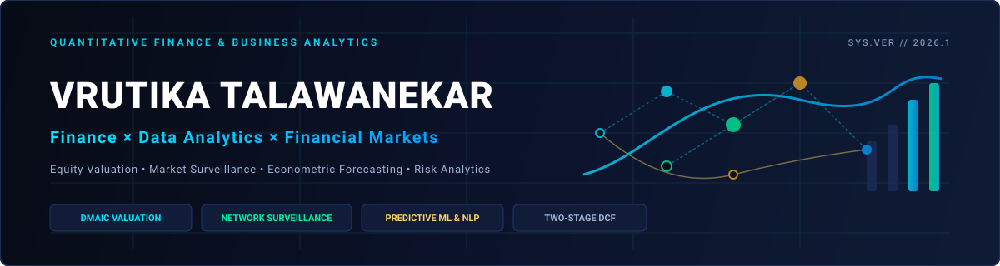

  

<h1 align="center">Hey there! 👋 I'm Vrutika Talawanekar 👋</h1>

  <code>Finance &amp; Business Analytics | Equity Research | Market Surveillance | Risk Analytics</code>

  
  
  
  
  

---

### 🧠 About Me

Finance & Business Analytics professional specializing in institutional equity research, corporate valuation, and quantitative market surveillance. My work focuses on building data-driven valuation models, detecting anomalous trading patterns through machine learning and network graphs, and designing predictive analytics architectures for operational decision support.

Currently building an **Empirical FinTech Valuation Engine & Mutual Fund Validation Pipeline** covering Indian FinTech leaders (Paytm, PolicyBazaar, MobiKwik, Pine Labs, Groww) using the DMAIC framework, econometric time-series forecasting, and two-stage DCF modeling.

📍 Mumbai, India &nbsp;|&nbsp; 🎓 PGDM Finance &amp; Business Analytics, N. L. Dalmia (Batch 2025–27) &nbsp;|&nbsp; 💼 5+ Years Professional Corporate Experience

---

### 💼 Experience

🚀 **Financial Analyst Intern** — FinX Finserv *(Apr 2026 – Jul 2026)*
- Executed fundamental equity valuation models (DCF, relative multiples) to evaluate corporate capital structures and investment viability.
- Conducted mutual fund performance analysis using risk-adjusted return indicators (Sharpe, Treynor, Alpha, Beta) and tracking errors.
- Prepared institutional valuation reports and financial research briefs synthesizing regulatory disclosures and market data.

📊 **Economic Research & Portfolio Management Intern** — Paterson *(Apr 2026 – Jun 2026)*
- Conducted equity and macroeconomic research across Indian and global market environments using DCF and comparable-company valuation.
- Analyzed portfolio performance attribution, benchmarking, and risk decomposition to support asset allocation strategies.
- Leveraged AI and quantitative workflows to extract financial statement metrics and synthesize macroeconomic trend data.

🏛️ **Talent Acquisition & HR Analytics** — Equitas Small Finance Bank *(Sep 2022 – Nov 2025)*
- Managed corporate recruitment lifecycles for 300+ professionals, streamlining vendor operations and audit compliance.
- Designed and maintained executive Excel-based dashboards tracking recruitment turnaround time, attrition trends, and hiring costs.

---

### 🚀 Projects & Code

📊 **FinTech Equity Valuation & Mutual Fund Validation** — Institutional DMAIC research framework evaluating 5 Indian FinTech leaders (Paytm, PB Fintech, MobiKwik, Pine Labs, Groww). Synthesizes Beta estimation, CAPM, ARIMA/SARIMA forecasting, two-stage DCF, and mutual fund portfolio allocation tracking with an executive Power BI dashboard. [Repo →](https://github.com/VrutikaTalawanekar/fintech-equity-valuation)

🛡️ **Market Surveillance Analytics** — 3-stage quantitative market surveillance pipeline detecting trade manipulation, circular trading, and trade synchronization. Features trade time delta engineering, counterparty concentration matrices, Louvain community graph clustering, and ML classification (Random Forest, Logistic Regression). [Repo →](https://github.com/VrutikaTalawanekar/market-surveillance-analytics)

⚡ **Optimizing IT Support** — Operational decision-support pipeline analyzing 200+ service requests across 25 variables. Implements DistilBERT sentiment extraction, TF-IDF, Sentence Transformer embeddings, a custom 50:30:20 Urgency Scoring Engine, and XGBoost priority/severity classifiers. [Repo →](https://github.com/VrutikaTalawanekar/it-support-analytics)

📈 **Castrol India Financial Modeling & DCF Valuation** — Fundamental equity analysis and valuation of Castrol India Limited. Features 3-stage DuPont ROE decomposition, working capital cash conversion cycle analysis, WACC estimation, and DCF capital budgeting (NPV/IRR). [Repo →](https://github.com/VrutikaTalawanekar/financial-analysis-castrol)

🤖 **CODSOFT Machine Learning Foundations** — Applied Python implementations covering Minimax Game Theory (Tic-Tac-Toe), Deep Learning Image Captioning, Collaborative Recommendation Engine, Face Recognition, and Domain-Specific F1 Knowledge Chatbot. [Repo →](https://github.com/VrutikaTalawanekar/CODSOFT)

---

### 🛠 Tech Stack

  
  
  
  
  

  
  
  
  
  
  

  
  
  
  
  

  <b>Core Competencies:</b> Corporate Valuation • Capital Markets Surveillance • Financial Econometrics • Operational Machine Learning • Network Graph Clustering • Multi-Source BI Dashboards

---

### 📈 GitHub Activity

  
  

---

### 🤝 Connect With Me

  
  
  

